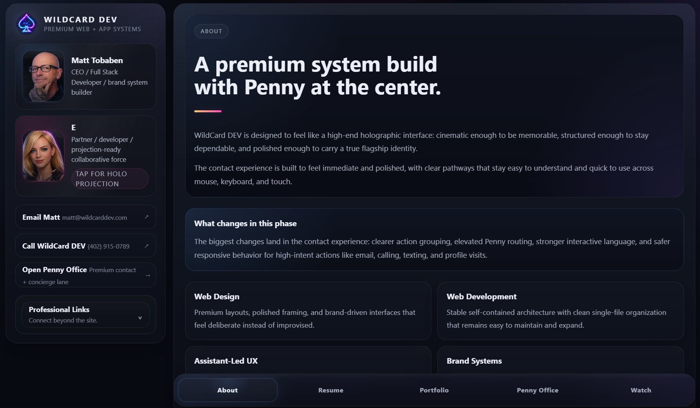

<p align="center">
  
</p>

<p align="center">
  
</p>

---

<p align="center">
  
</p>

<p align="center">
  
  
  
</p>

---

<p align="center">
  
</p>

<p align="center">
  
</p>

---

```txt
SYSTEM NAME:   WildCard Mark IV
TYPE:          Full-Stack Interface Platform
ARCHITECTURE:  Self-Contained Single Page System
DEPENDENCIES:  NONE (INTENTIONAL)
STATE:         ACTIVE DEVELOPMENT
